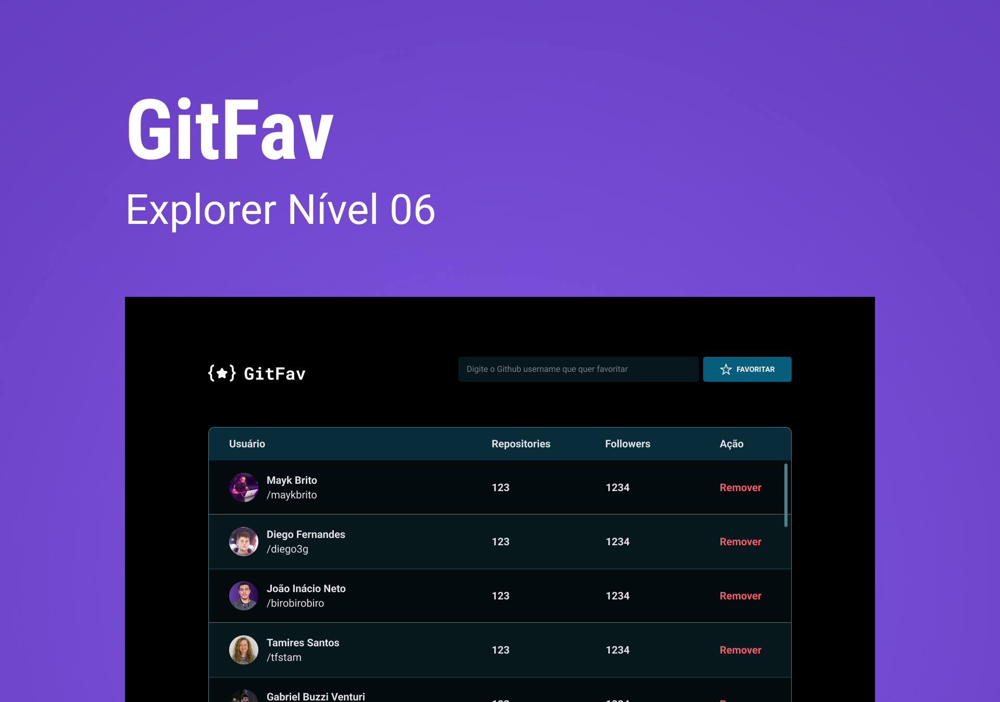

<h1 align="center"> GitFav </h1>

Este projeto é promovido pela Rocketseat para ensino de tecnologias WEB.  

  <a href="#-tecnologias">Tecnologias</a>&nbsp;&nbsp;&nbsp;|&nbsp;&nbsp;&nbsp;
  <a href="#-projeto">Projeto</a>&nbsp;&nbsp;&nbsp;&nbsp;&nbsp;&nbsp;

 

  

## 🚀 Tecnologias

Esse projeto foi desenvolvido com as seguintes tecnologias:

- HTML e CSS
- JavaScript
- Git
- Figma

## 💻 Projeto

Projeto realizado no Stage 06, na plataforma da Rocketseat para consolidar conhecimentos adquiridos sobre JavaScript no HTML e DOM. Desafio de construir um Favorite do GitHub.

- [Visite o projeto online]()
